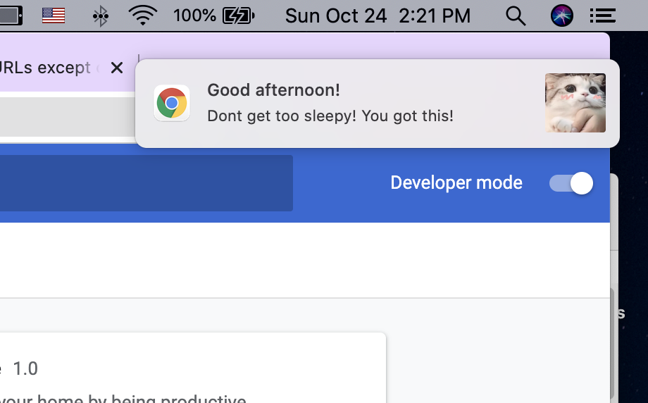
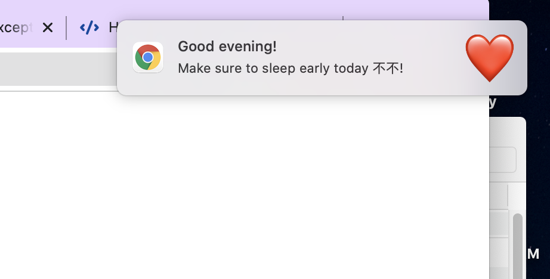
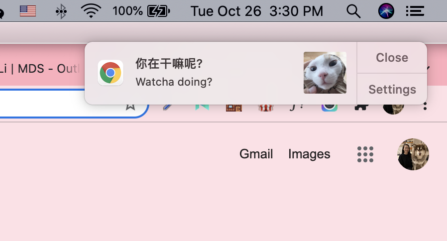
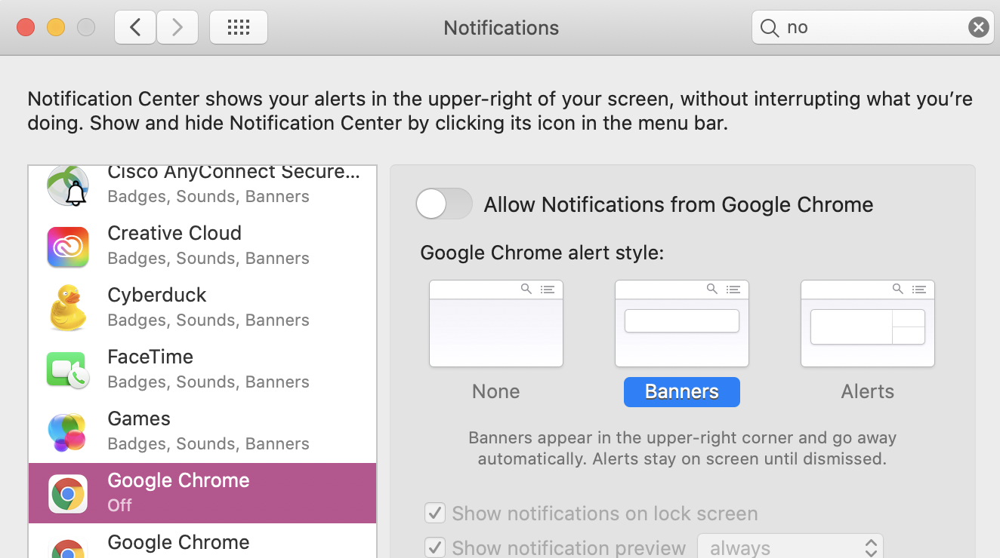

# mini proj 5

A browser extension as a gift for my bf

For this project, it took me a while to figure out what exactly I wanted to create. I wanted to create something personal, sweet, and something that he will actually use.

So, I wanted to give him small messages from me throughout the day.

Initially, I wanted to force the popup window to popup whenever the cursor is idle for too long. But, after trying for so long to find a solution, it turns out chrome doesn't allow you to do that.

So, I changed my concept to make it notifications which was actually a better concept because it's more similar to actual messages.

There are 4 messages in total. 3 different messages are displayed throughout the day. 1 in the morning, afternoon and evening.The last message is when the cursor is idle for 2 minutes. The notification just shows the message of "Watcha doing" with WeChat stickers we normally send each other. This notification doesn't just show for a few seconds like the other 3 does. It's persistent on the screen until it's close to cover cases where he steps away from the computer.

I ran into a lot of troubles trying to get my notifications to popup. One of which was with my own computer blocking notifications from chrome.

