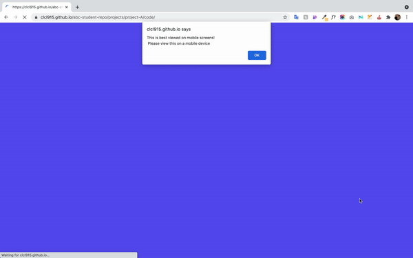
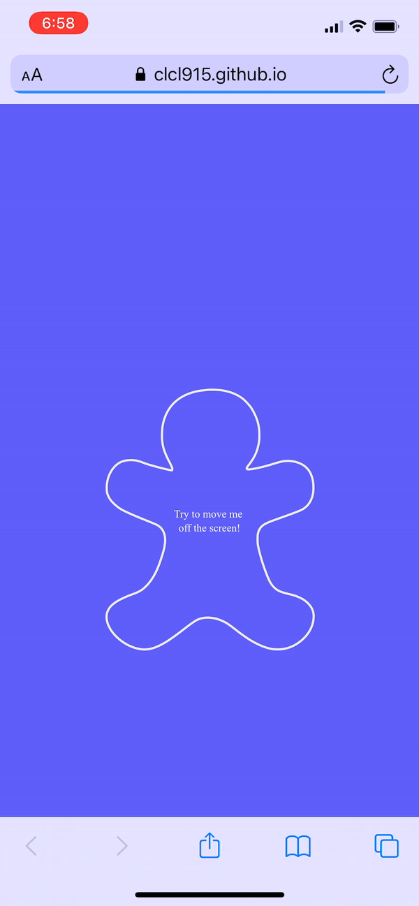

# Mobile Me ✋

## Project Concept

### Initial Idea
My initial idea for this project was quite ambitious. I knew I was set on making this project a mobile first project. I wanted to have a project that just shows the composition of water in the human body. With roughly 60% water, the body was a great staple piece for this simple project.     

These were my paper prototypes for my initial idea:

I wanted to start with a blank screen and then have this outlined body to suddenly smack down on the screen. Slowly water would fill from bottom to 60% of the body. Then when if you were to tilt your phone, the water inside would also tilt in the same direction.  

Then I wanted to introduce the concept of dehydration by using the Web APIs. The water level in the body decreases due to factors like exercise and weather. I wanted to capture the user's location and weather with the Geolocation API. If the user was in a hot place, the water level would decrease at a faster pace. I also wanted to detect if the user was moving with the Sensor API, rapid movement would decrease the level as well.

There was definitely some challenges to this initial idea, some being that the user wasn't going to keep being on this site for the whole day and what would happen if there's no more water. So, I tried to see if it was feasible by tackling the first part first. After testing, I realized what I wanted to make was much more complex that I thought. The Web API that I wanted to use wasn't recommended to use by Mozilla and problems with detecting movement was a big problem too. So, I ultimately decided that I had to alter my project.

### Final Idea
Going back to the brainstorming bubble, I was still set on creating a mobile-first site and I also wanted to retain the outlined body. So I shifted the project to be a little, pesky companion. There's no clear outcome or goal to this project. This body just sits on the page powered by some interaction with the user. I dialed in on the concept of "annoyingness."

## Development
### Device Detection
By having the focus on mobile, I had to first make sure I directed users to mobile if they were on desktop. So, I utilized navigator.maxTouchPoints to detect the device the user was viewing the site on.

### Desktop
For the Desktop version, I wanted this to be an additional feature to the project. So, I first included an alert that informs the user to switch a mobile device to view this project. After the user closes the popup, I decided to add a CSS animation of emojis turning from happy to angry. The animation kind of looks like the faces are warping togther with each transition. It wasn't intentional but I think it was actually really nice. At the end, I also choose to add a "GO AWAY" message to annoy the user that they just watched the whole animation for nothing.

              

### Mobile
For the Mobile Desktop, the screen starts off with the outlined body and a text in the middle of the screen that says "Try to move me off the screen." Then the user would use their finger to try to drag the body off the screen. The text will change to say "Oh you're moving me to" some x y coordinate. But, it's impossible to drag it off the screen. When the user lets go of the body, it'll return back to the middle of the screen with a "and I'm back haha" message. After 8 seconds, the interaction stops and ends with a short text that says "hahaha. I'm still here. This is fun. Let's keep playing. REFRESH ME!"

I purposely added these messages that hinted that this body was mocking or teasing you. With the "haha"s and the "this is fun. Let's keep playing", I really wanted to add to the pesky effect. I wanted this to be a short, meaningless conversation with this body.

#### Mobile Design
To quickly highlight on the design of the assets, I used a SVG for the outlined body and did a quick edit in Illustrator. I originally had a more realistic body, but up again the background looks too much like a crime sense. So, I changed it to a gingerbread man outline to add the effect of a cute tiny little friend.

## Quick Access
This website can be viewed [here](https://clcl915.github.io/abc-student-repo/projects/project-A/code/index.html).
