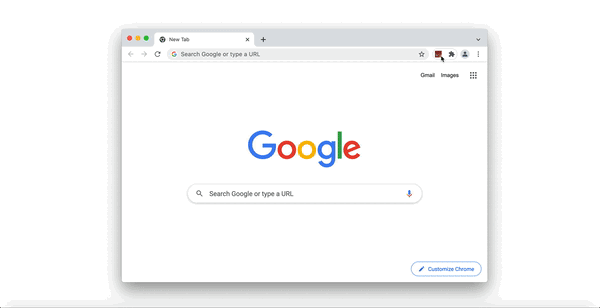
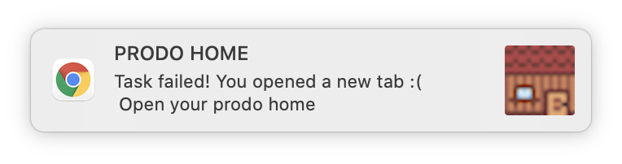
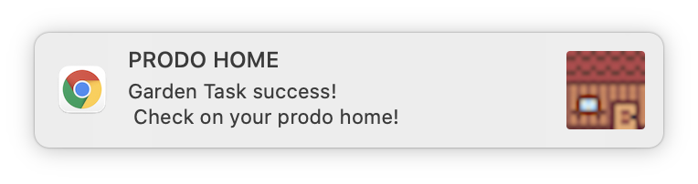
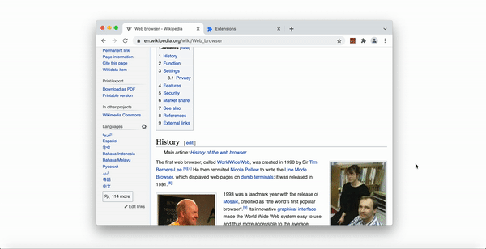

# PRODO HOME 🏠

Build your virtual home by being productive

This extension is designed as a productivity mini-game right in your chrome extension. Prodo Home is equipped with little helpers that help you build your virtual home in the background. All you have to do is be productive. Don't switch to a different tab, go idle for too long, or walk away from the computer. If you stop working, your little helpers stop working.

Keep yourself accountable with your work by playing Prodo Home while you work. This extension is flexible with your studying habits. Choose time periods you want to be productive for and have your little helpers carry out corresponding tasks.

 

<button name="button" onclick="https://github.com/clcl915/abc-student-repo/blob/master/projects/project-B/code.zip" style="border-radius:20px;padding:15px;text-align:center;background:green;color:white;font-weight:700">DOWNLOAD PRODO HOME HERE</button>

 

For this extension, the main APIs used was chrome.alarms, chrome.notifications, chrome.storage, and chrome.idle.
These APIs were utilized to detect the user's movement in the browser. So, after the user selects a task or time interval they want to be productive, a chrome.alarm will start.

If the user doesn't move their mouse in a while (default is set to 5 minutes), then the task fails and a notification will pop up. The same also happens when the user changes tabs.

But, if the user is actually productive and continued to be on the page for the allocated time, a success notification will popup and prompt you to open your home again.

The home has been updated with the help of your work and your little helpers in the background. (You can see in the gif below: the gardening task was successful and there are now some mushrooms.)

Chrome.storage was used to detect different stages of the game and used to display different elements based on storage. I definitely ran into a lot of challenges with the local storage and then communicating between the background script and the popup script. I had the most trouble trying to implementing the storage when the browser gets restarted. But, as the current version with no further levels, I think having the home restart every time your browser restarts is a good point of pause (for now! more updates to come).
