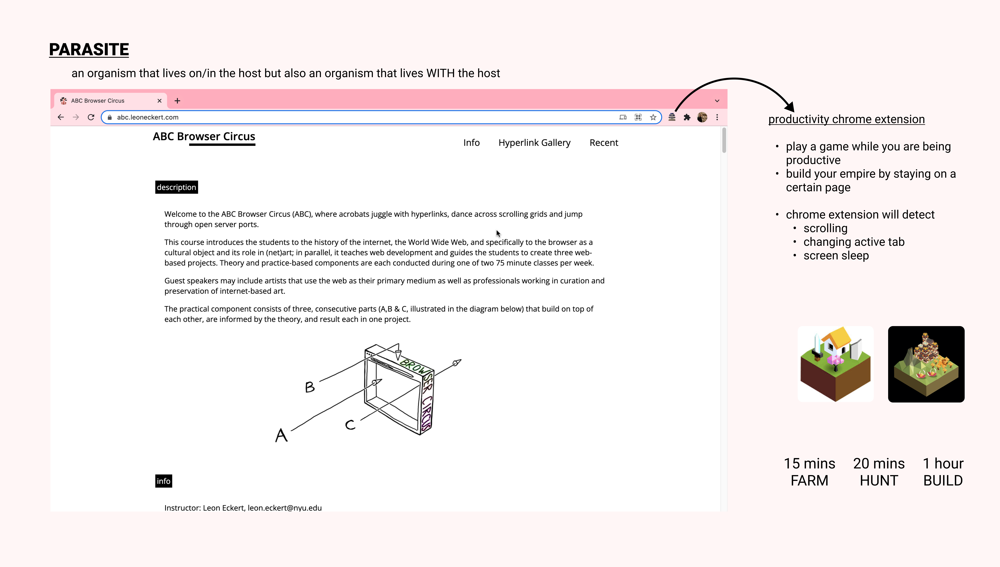
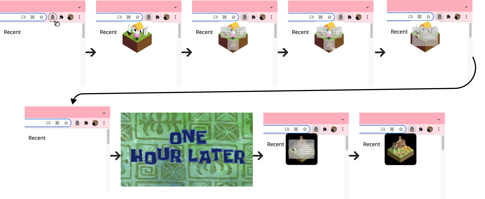

# Parasite Project - Prototype

A parasite is an organism that lives in/on another organism. I took the concept of a parasite living on another organism and shifted it an organism living "with" another organism. So, I wanted this chrome extension to live and be in the web space that the user is present in too. With that idea in mind, I headed towards the productivity route and drew inspiration from the Forest mobile app where the user can grow their own trees when focusing.

I really like the Forest app's concept of planting trees and at the same time actually planting trees in real life. The use of a tree that grows and grows and provides back to the world is such an amazing focus, but I want to give a twist on it. As for what exactly my organism is going to be, I still haven't got to a concrete answer but I'm thinking more of characters like in games like Polytopia, Pokemon, and Plants vs. Zombies. But, maybe the underlying message of this extension can be like a game. You have to give up playing games to do work, but what if you can play a game while you do work!

**Initial Thinking**

The chrome extension will be an organism that grows with you as you are being productive. The organism will be default top right sticky on the page so it will be with the user on the page. The more time you spend on a single site, the organism will grow/hatch. My initial thinking is an egg that will slowly hatch and grow and bloom. So for example, when the user visits and remains the ABC page, [abc.leoneckert.com](http://abc.leoneckert.com/), the user can click on the extension and start the organism will start to grow. When say 30 mins go by, the organism will be 1 year old. When the user walks away from the screen and the screen sleeps, the organism will also sleep. If the user changes tabs, the organism will also sleep again. At one point, the organism will grow to it's maximum state, like a full grown adult bird, and then the user can keep it in the digital popup of the extension.

**New Idea**

The chrome extension will be an empire that grows with you as you are being productive. The empire will be default top right sticky on the page so it will be with the user on the page. The more time you spend on a single site, the empire will go into full play. When pressing on the empire icon, a popup will appear with your current empire and goals you want to achieve in you empire (like farm or hunt/tend wild animals or build something). Each goal would be time related like 15 minutes, 30 minutes, 1 hour to achieve. When you press on a goal then your empire helpers will get to work, the popup will close, and prompt the user to stay on the page and be productive. If the user ever gets distracted like opens another tab or opens the popup, the helpers will stop and the goal would be failed. So for example, when the user visits and remains the ABC page, [abc.leoneckert.com](http://abc.leoneckert.com/), the empire will appear and goals will be prompted. When the goal is selected (how many minutes you want to be productive), then the popup will close and a countdown will begin and the user needs to be productive. If the user changes tabs, opens the popup, or if the cursor is too idle for too long, the goal is failed.

