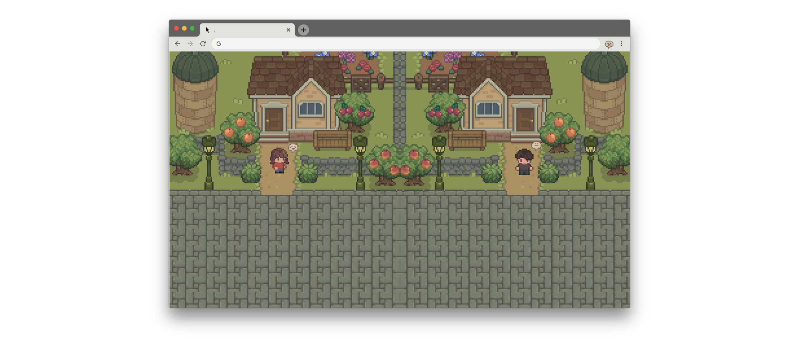

# ToastyTown

ToastyTown is an alternative to the current social networks to introduce a more cozy, whimsical, and inclusive experience to strengthen relationships online. No matter how far apart, users will be connected with just a click of a website.

Enter this virtual world and come together with your friends. Let this town by a free space to chat and explore with your friends.

<p align="center">
</p>

<br>
<p align="center">

[PLAY TOASTYTOWN HERE](https://toasty-town.glitch.me/)

</p>

<hr>
<br>

Taking inspiration from the 2000-2010 era of 2D pixel art games, I developed ToastyTown with vanilla Javascript and Socket.io. I researched a ton of JS game development and drew a lot of reference from YouTube and Medium videos. Two of which was this [Codepen](https://codepen.io/punkydrewster713/pen/WNrXPrb) and [3D MMORPG game](https://www.youtube.com/watch?v=IptkgFOoci0&t=147s).

<p align="center">
</p>

When a user connects, the server emits addUser to the client and a new character is made. The character name is assigned after the user inputs a name. Then the character is placed in the town.

<p align="center">
</p>

On character movement, movement gets emitted to the server and then back to other clients. Using window.requestAnimationFrame() movement and animations can be displayed smoothly.

```
const step = (posX, posY, player) => {
  document.getElementById("date").innerHTML = new Date().toLocaleTimeString();
  moveCharacters(posX, posY, player);
  window.requestAnimationFrame(() => {
    step(posX, posY, player);
  });
};

```

</p>

## Next Steps

For this project, there was a lot of debugging and compromising.
Initially, I wanted to personally create the assets, but due to time constraints, the assets were referenced from itch.io, courtesy of [LimeZu](https://limezu.itch.io/serenevillage). But, I want to continue this project and I would love to make my own sprites and map with a 2D pixel art aesthetic. I will research into using Aesprite for that.

I also wanted to implement a select mood function and individual rooms for each user with socket.io rooms. It would really cool to have private chat and chat history shown.
<div style="display:flex;justify-content:center;align-items:center">
<p align="center">
</p>
<p align="center">
</p>
</div>

A suggestion I got from user feedback was to add more opportunities to interact with the town itself. For example, moving a rock to a different location and then returning it back to the original location after a day.
